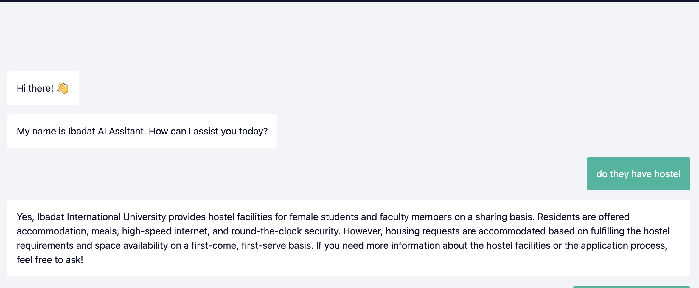
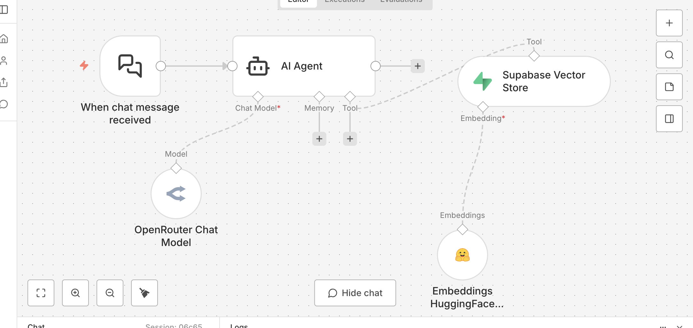

# Ibadat AI Assistant


An AI chatbot for Ibadat International University built on
Agentic RAG — students ask about fees, admissions, hostel,
campus rules and get answers pulled straight from official
university documents. No guessing. No hallucination.
Built entirely in n8n. No custom backend.


---



---

## Features

- **Agentic RAG** — AI Agent reasons before retrieving,
  not a basic chain that blindly runs on every message
- **Zero hallucination** — answers come only from official
  university documents stored in Supabase
- **Semantic search** — finds meaning, not just keywords.
  "how much does CS cost" matches "fee structure for
  BS Computer Science" without exact word overlap
- **Always available** — public URL, no login, works on
  any browser or device 24/7
- **Off-topic refusal** — ask something unrelated,
  it politely declines without touching the database
- **Easy to adapt** — swap the document and system prompt,
  deploy for any institution

---

## How it works

```
Student sends message
    → AI Agent reasons about the query
    → calls Supabase vector store tool if needed
    → HuggingFace embeds query → 384-dim vector
    → pgvector finds closest document chunks
    → Agent answers from retrieved chunks only
    → streams back under 3 seconds
```



---

## Stack

- **n8n** — orchestration + public chat interface
- **Supabase** — PostgreSQL + pgvector for vector storage
- **sentence-transformers/all-MiniLM-L6-v2** — embeddings
- **GPT-4o-mini** via OpenRouter — reasoning + generation
- **Google Drive** — source document storage (.md)

---

## Getting Started

### 1. Set up Supabase

Run both SQL files in your Supabase SQL Editor — in order:

```sql
-- First
/database/schema.sql

-- Then
/database/rpc_function.sql
```

Check Table Editor — you should see `university_knowledge`
with columns `id`, `content`, `metadata`, `embedding`.

---

### 2. Add credentials in n8n

Settings → Credentials → Add Credential. You need four:

| Credential | Where to get it |
|---|---|
| Supabase | Dashboard → Settings → API |
| HuggingFace | huggingface.co → Settings → Access Tokens |
| OpenRouter | openrouter.ai → Keys |
| Google Drive | OAuth2 — n8n guides you through it |

---

### 3. Upload your knowledge document

Upload your document to Google Drive in `.md` format.
Get the file ID from the share link:

```
drive.google.com/file/d/YOUR_FILE_ID_HERE/view
```

---

### 4. Import the workflows

n8n → Workflows → + → Import from File

Import both from `/workflows/`:
- `ingestion_pipeline.json`
- `retrieval_pipeline.json`

Replace all `YOUR_*` placeholders in both workflows
with your actual credential IDs and Google Drive file ID.

---

### 5. Run ingestion

Execute the ingestion workflow once. Nodes should go green.
Check Supabase — rows should appear with content and
embedding data.

> If HuggingFace times out on first run, wait 20 seconds
> and retry. Free tier cold-starts after inactivity.

---

### 6. Go live

Activate the retrieval workflow. Copy the public chat URL
from the Chat Trigger node. That is your live assistant.

---

## Adapting for your own use case

Replace the Google Drive document with your own `.md` file,
update the system prompt in the AI Agent node, re-run
ingestion. Everything else stays the same.

---


## Contact

Built by **Fawad Amin** · 

If you found this useful, want to adapt it for your own
institution, or just want to talk about RAG and n8n —
feel free to reach out.

[](https://github.com/Fadi432)
[](www.linkedin.com/in/fawad-amin-07414337b)

---

## License

Open source under the **MIT License**
use it, fork it, adapt it for your own institution.
